# Prisms

**A local-first goal-execution platform.** You state a long-term vision, break it
down until it lands on a calendar, and work the plan — offline, on any device,
with the whole thing syncing to a server you own.

Prisms decomposes ambition through six layers:

```text
Vision → Roadmap → Project → Milestone → Task → Schedule block
```

Skills and habits run as a parallel track: they attach directly to a vision and
produce recurring practice, streaks, daily targets, and accumulated practice
hours.

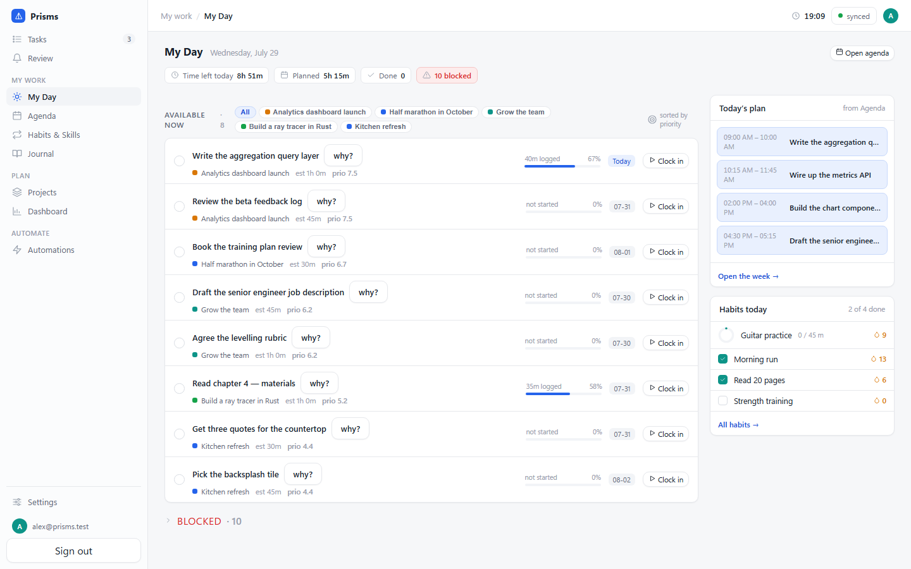

---

## Why it's built this way

Most planners are either a calendar that forgot why you're busy, or a
goal-tracker that never touches your day. Prisms keeps the chain intact: every
scheduled block traces back to a vision, and every vision eventually shows up
as an hour in your week.

Three constraints shape the whole system:

- **Local-first.** Every read and write hits a local SQLite database first. The
  UI never waits on the network. Clock in on a plane, complete a task in a
  tunnel, edit your agenda offline — it all converges when you reconnect.
- **You own the server.** Vanilla PostgreSQL is the source of truth; one
  `docker compose` command runs the entire stack on your own hardware. No
  managed service is required anywhere in the architecture.
- **Commands, not row patches.** Clients never send arbitrary SQL or generic
  entity updates. They upload named command envelopes (`node.check_off`,
  `block.move`, `timer.clock_in`, …), which is what makes offline conflicts
  resolvable and history explainable.

---

## Features

### Plan the day, not just the year

**My Day** puts what's actually actionable in front of you — available now,
blocked, done today — sorted by the priority of the project each task belongs
to. Every task can answer *why?* by tracing its ancestry back to a vision. A
running timer lifts into a global pill you can clock out of from any screen.

**Agenda** is a week calendar beside your to-do list. Drag a task onto the week
and the valid time windows light up while everything else dims; drop it in a
valid slot and it becomes a committed block. The task rides your cursor as you
drag, and an outline shows exactly where it would land — its real length, the
hour lit up behind it, the start and end times written on it — snapped to
15-minute steps, or whatever interval you pick in Settings. Anchored blocks
refuse the drag. Past time entries render as a faint history layer behind the
plan.

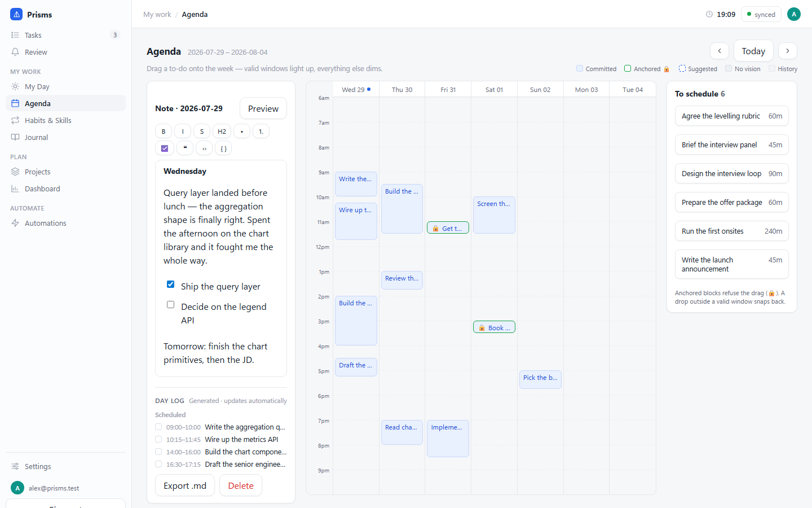

### Every task in one place

Capture anything into the **Inbox** without choosing a parent — it waits there
until you promote it into the tree. Tasks group by project or by status, and
each row carries its own checklist of substeps.

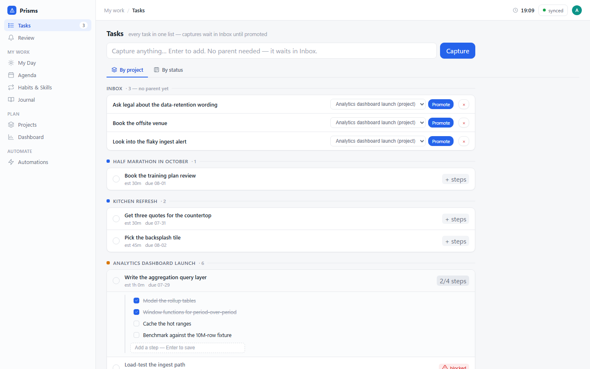

### Four views on the same plan

The **Projects** hub scopes to one project or all of them, and shows it four
ways.

| Board — kanban by date | Timeline — Gantt + critical path |
|---|---|
| 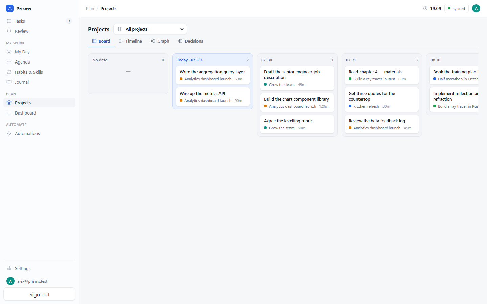 | 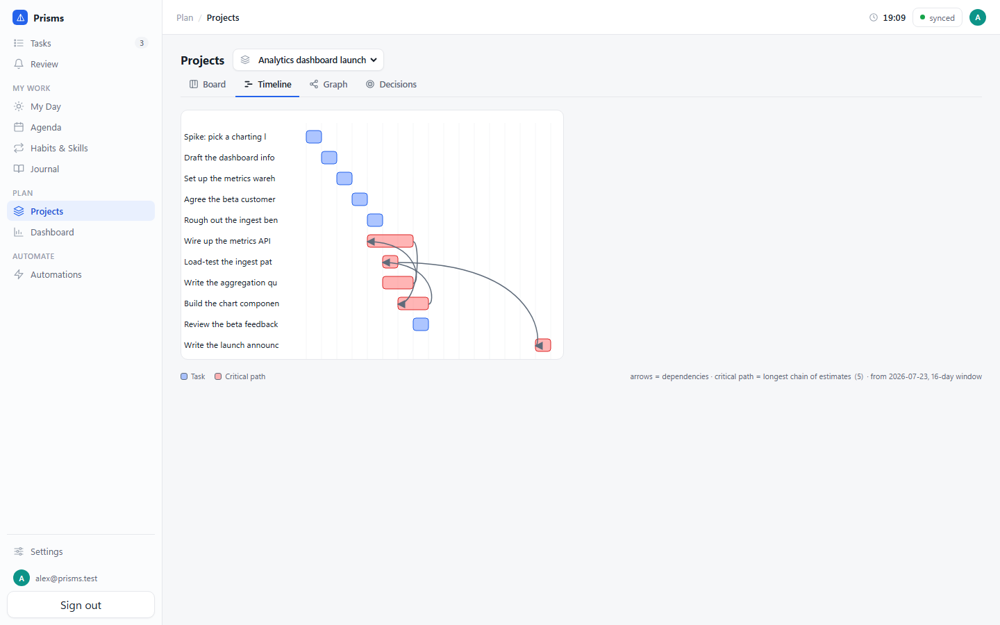 |

| Graph — the dependency DAG | Decisions — weighted priority |
|---|---|
| 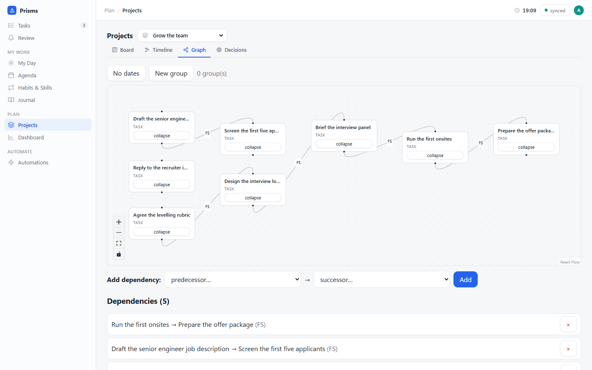 | 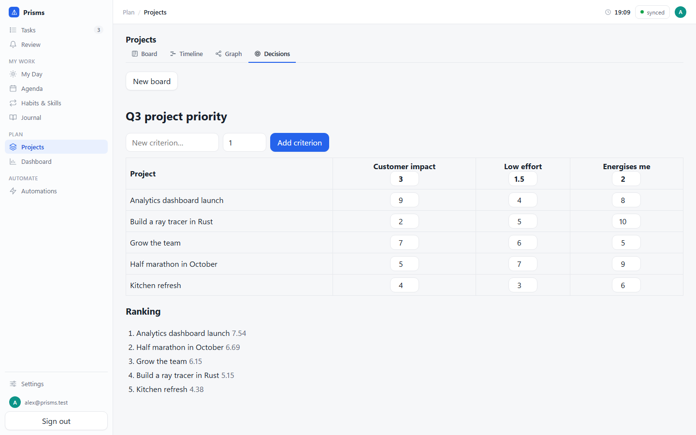 |

- **Board** — non-done tasks in a backlog plus day columns; drag a card to
  another day to re-date it.
- **Timeline** — one bar per task, dependency arrows, and the critical path
  (longest chain of estimates) highlighted.
- **Graph** — a canvas of nodes and their dependency edges. Drag between
  handles to create a dependency; cycles and type mismatches are rejected
  instantly, offline, before the server ever sees them.
- **Decisions** — a weighted decision matrix. Criteria are columns with
  editable weights, projects are rows, each cell a 0–10 score. The ranking
  recomputes live, and it is what orders your task list on My Day.

### Know whether you're winning

The **Dashboard** shows burndown against the scheduled line with a projected
finish date, per-project completion, the live priority ranking, and habit
streaks. Every panel is computed from local facts, so it renders offline.

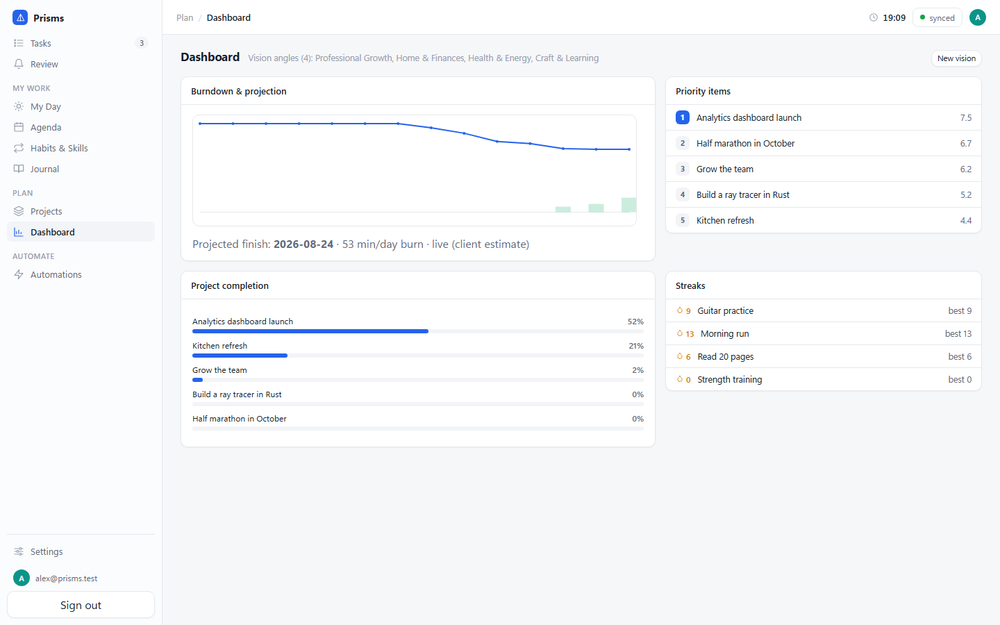

### Habits and skills

Recurring practices tied to a vision, with six streak modes (daily, weekly,
monthly, quarterly, yearly, and perfect-planned), daily-target rings, and — for
skills — practice-hour accumulation, levels, and mastery progress. The ring
fills while a skill task's timer is running.

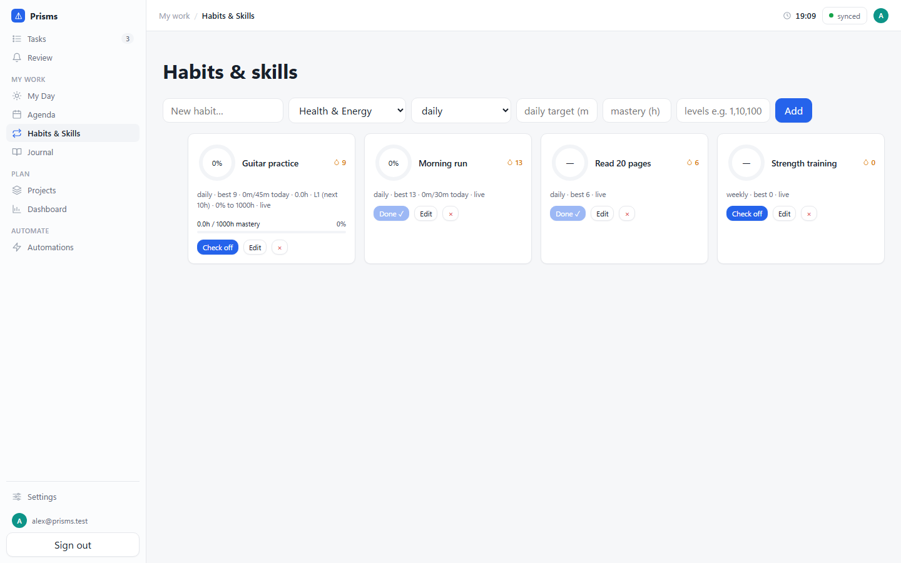

### A journal that writes half of itself

One markdown note per day in a WYSIWYG editor with working checkboxes, browsable
by month, exportable as `.md` or a full `.zip` archive. Each day carries a
generated **day log** footer of what was scheduled and completed — derived at
render time, never stored.

Months load lazily: a month subscribes its rows only when you open it, so years
of journaling never weigh down sync.

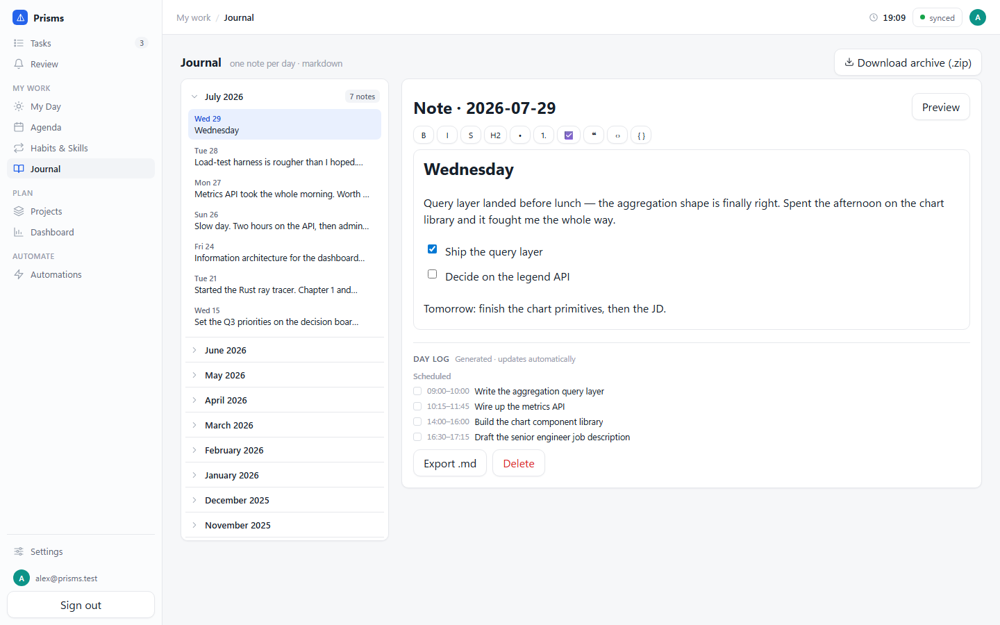

### Automations

**Rules** spawn templated follow-up tasks when a task is created or completed,
with `{trigger.title}`-style interpolation and trigger-relative due dates.
**Blockers** are predicates that gate tasks — "waiting on an unfinished
dependency", "rain probability above 60%" — evaluated locally, so a task goes
blocked instantly and offline. Both are validated client-side before the write.

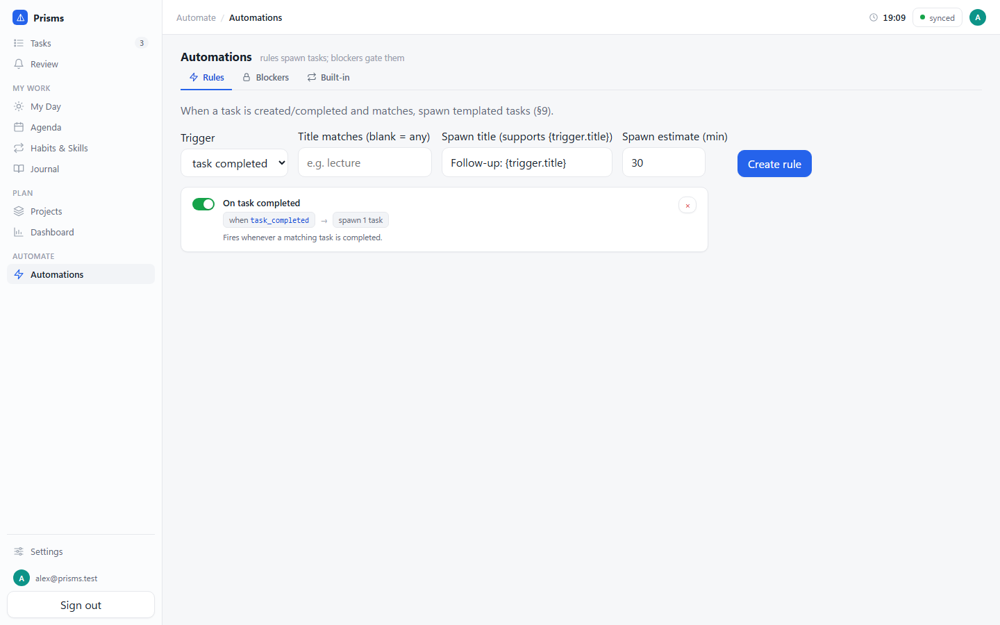

### Also in the box

- **Review inbox** — server rejections, edit conflicts, stale suggestions, and
  automation drift become durable, reviewable items instead of a toast you
  missed while offline.
- **Scheduling assistance** — a greedy earliest-fit scheduler plus a weighted
  optimizer that proposes block placements you accept or reject.
- **Time tracking** — clock in/out with a focus review on clock-out; double
  clock-in is impossible by construction, even across two offline devices.
- **Backup & portability** — versioned `prisms-export` backup/restore with
  optional passphrase encryption. Import restores rows as data; it never
  replays your command history.

---

## Platforms

| Client | Stack | Surface |
|---|---|---|
| **Web** | Vite + React, PowerSync on wa-sqlite/OPFS, installable PWA | The full feature set |
| **Desktop** | Tauri v2 shell around the web build | Full feature set + OS notifications |
| **Mobile** | Expo / React Native | Today, Agenda, Kanban, Habits, Dashboard, Review, read-only graph, local notifications |

All three share the same domain logic and reactive data layer, and all three
work offline against their own local database.

---

## Getting started

**Requirements:** Node 26+, pnpm, and Docker (with Compose v2).

```bash
pnpm install
```

Bring up Postgres and the sync service:

```bash
docker compose up -d
```

Apply migrations and (optionally) load a demo dataset:

```bash
pnpm --filter @prisms/db db:migrate
```

```bash
pnpm --filter @prisms/db db:seed
```

Then run the API and the web app in two terminals:

```bash
pnpm --filter @prisms/server dev
```

```bash
pnpm --filter @prisms/web dev
```

The app is at **http://localhost:5173** — register an account and you're in.
In development, Vite reverse-proxies `/api` and `/sync` to the API on `:3001`,
so the browser stays same-origin.

> The `api` service in `docker-compose.yml` is a placeholder that only answers
> `/health`. The real API runs on the host via the command above; the
> one-command deployment is `docker-compose.prod.yml`.

### Mobile

```bash
pnpm --filter @prisms/mobile start
```

### Desktop

```bash
pnpm --filter @prisms/desktop dev
```

### If the default ports are taken

Host ports are overridable from a gitignored `.env` at the repo root — e.g.
`PRISMS_POSTGRES_PORT=5434`, `PRISMS_POWERSYNC_PORT=8081`. If you remap the
PowerSync port, point the web client at it too, via `VITE_POWERSYNC_URL` in
`apps/web/.env.local`.

### Windows without Docker Desktop

Docker Engine inside WSL2 works fine — prefix the compose commands:

```powershell
wsl docker compose up -d
```

WSL shuts down when idle; re-running any `wsl docker …` command boots it again
and the containers restart automatically.

---

## Self-hosting

One command on a clean host brings up Postgres, PowerSync, the API, and the web
bundle:

```bash
cp .env.example .env
```

```bash
docker compose -f docker-compose.prod.yml up -d --build
```

See **[docs/SELF_HOSTING.md](docs/SELF_HOSTING.md)** for secrets, JWT key
derivation, backup/restore, and upgrade notes.

The `web` container serves plain HTTP — terminate TLS in front of it. Auth
cookies are `Secure`, so sign-in only works over HTTPS (or `localhost`).

---

## Repository layout

| Path | Package | Purpose |
|---|---|---|
| `packages/core` | `@prisms/core` | Pure domain logic — no IO, no wall clock, no randomness (lint-enforced) |
| `packages/db` | `@prisms/db` | Drizzle schema, forward-only migrations, PowerSync sync streams |
| `packages/ui` | `@prisms/ui` | Shared reactive React hooks, platform-neutral |
| `apps/web` | `@prisms/web` | Vite + React SPA |
| `apps/mobile` | `@prisms/mobile` | Expo (React Native) |
| `apps/desktop` | `@prisms/desktop` | Tauri v2 shell |
| `apps/server` | `@prisms/server` | Hono API + Better Auth + command dispatcher + pg-boss jobs |

`packages/core` holds every scheduling, status, aggregate, and merge decision as
deterministic pure functions, so the same answer comes out on the server, in the
browser, and on a phone. Package boundaries and core purity are enforced by
ESLint (`eslint.config.mjs`) and regression-tested.

### How a write travels

1. The client mints a command id and a hybrid logical clock, applies an
   optimistic effect to a local overlay, and renders immediately.
2. The overlay sits on top of a read-only replica synced down from Postgres;
   the UI reads the merge of the two. Rollback is dropping the overlay entry.
3. The envelope uploads when there's a connection. The server owns every trust
   field — ownership, provenance, timestamps — and re-checks invariants.
4. The canonical row syncs back down. Conflicts resolve by per-field
   last-write-wins on the HLC, with explicit merge functions where that isn't
   right (time entries union rather than sum).
5. Anything the server refuses becomes a durable item in your Review inbox.

---

## Tests

```bash
pnpm turbo lint typecheck test
```

Beyond the main gate:

| Command | What it covers |
|---|---|
| `pnpm --filter @prisms/core test:coverage` | Core coverage floor (≥90%) |
| `pnpm test:convergence` | Two-device offline convergence harness |
| `pnpm --filter @prisms/web e2e` | Playwright end-to-end against a live stack |

The e2e suite needs the full stack running and the API started with
`BETTER_AUTH_URL=http://localhost:5173` and
`BETTER_AUTH_TRUSTED_ORIGINS=http://localhost:5173`. Cookie-authenticated POSTs
require a trusted `Origin`; the API's own origin is always trusted, and
cross-origin clients like the Vite dev server are added through that variable.
